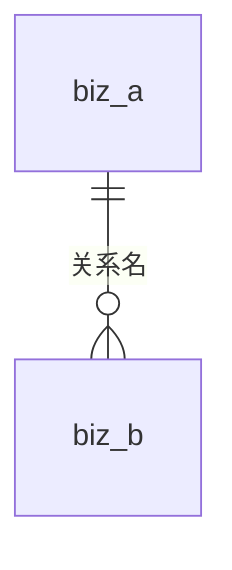

# <模块>建模

- 状态: 待确认
- 业务描述: <用户原话>

## 假设

<!-- 用户没说清、建模时做了假设的地方,逐条列出,确认时让用户一并看。没有就删掉本节 -->

1. 

## ER 图

<!-- 基数: ||--|| 1-1;||--o{ 1-n(n 可为 0);||--|{ 1-n(n 至少 1);}o--o{ n-n(落地为中间表) -->

## 实体

### biz_<表> <业务名>(模型 <Model>)

<!-- 一句话说明这张表存什么 -->

| 字段 | 业务名 | 类型 | 必填 | 唯一 | 默认 | 说明 |
|---|---|---|---|---|---|---|
| | | | | | | |

固定字段(不用写): id、createdAt、updatedAt、createdBy、updatedBy

## 关系

| 关系 | 基数 | 必填 | 删除时 | 理由 |
|---|---|---|---|---|
| | | | | |

<!-- 删除时: 不让删(默认)/ 一起删 / 解除关联 -->

## 索引与唯一约束

| 表 | 字段 | 唯一 | 理由(对应的查询场景或业务规则) |
|---|---|---|---|
| | | | |

<!-- 外键列默认建索引,已是主键 / 唯一约束 / 其他索引第一列的不重复建,这里也要列出 -->

## 变更与影响

<!-- 仅修改已有表时填写;新建表删掉本节 -->
