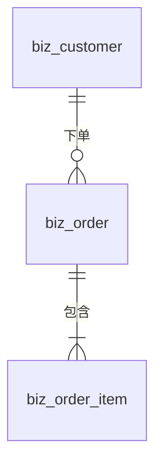

# model-project 设计:辅助用户做数据库建模

> 状态: 待审查。

## 一、定位

```
init-project -> model-project(建模)-> AI 写代码 -> e2e-project -> deploy-project
```

**业务怎么建模由用户决定,代码由 AI 写。**

- `server/prisma/schema.prisma` 是数据库结构的**唯一真源**,和主流开源项目一样直接维护它,不引入生成器或中间格式
- model-project 的产出是**一份建模文件**:把表、字段、类型、关系、主外键、索引以及每个决定的理由写清楚,用户确认后 AI 照着改 schema
- 建模文件是**当时的设计决策记录**,和 schema 不做同步;以后结构以 schema 为准,再改就再出一份新的建模文件

## 二、流程(6 步)

| 步 | 做什么 | 谁拍板 |
|---|---|---|
| 1 收集业务 | 用户用自然语言描述:有哪些东西、怎么流转、有哪些规则。AI 读现有 schema,一次问完缺的信息 | 用户 |
| 2 出建模文件 | AI 按模板写建模文件:ER 图、实体与字段、关系、索引、理由 | AI |
| 3 自查 | AI 按第五节的清单逐条检查,不符合的改掉或在文件里写明原因 | AI |
| 4 用户确认 | 用户看建模文件(VS Code 预览或 GitLab 页面都能直接显示 ER 图),提修改意见,改到用户确认为止 | **用户** |
| 5 落地 | 改 `schema.prisma` -> `pnpm db migrate --name <改了什么>` -> 读迁移 SQL,确认没有意外的删除 | AI;破坏性变更须用户确认 |
| 6 核对 | `pnpm db studio` 打开 Visualizer,核对实际结构与建模文件一致;建模文件状态改为"已落地" | AI |

提问一律用业务语言,AI 负责翻译:

| 不这样问 | 这样问 |
|---|---|
| onDelete 用 Cascade 还是 Restrict | 删除客户时,他的订单怎么办:一起删 / 不让删 / 保留订单但解除关联 |
| 要不要建索引 | 订单列表要按什么筛选、排序、搜索 |
| 这个字段要 @unique 吗 | 订单号会不会重复?全局不重复,还是同一客户下不重复 |
| 1-n 还是 n-n | 一个订单能有几个商品?一个商品能出现在几个订单里 |

**修改已有表**时,建模文件里加一节"变更与影响":

| 变更 | 处理 |
|---|---|
| 删表、删字段、改类型 | 破坏性,写明影响,必须用户确认 |
| 可空改必填、新增必填字段 | 写明已有数据用什么值填 |
| 新增或修改唯一约束 | 先查现有数据有没有重复 |
| 改删除策略 | 写明对已有数据和业务代码的影响 |

## 三、建模文件

- 位置: `docs/YYYYMMDDHHMMSS_<模块>建模.md`(沿用 docs 的命名规则,入库)
- 一次建模一份;一份可以包含一个模块的多张表

模板:

````markdown
# <模块>建模

- 状态: 待确认 / 已确认(确认人, 日期) / 已落地(迁移名)
- 业务描述: <用户原话>

## ER 图



## 实体

### biz_order 订单(模型 Order)

| 字段 | 业务名 | 类型 | 必填 | 唯一 | 默认 | 说明 |
|---|---|---|---|---|---|---|
| orderNo | 订单号 | 短文本(32) | 是 | 同客户下唯一 | | |
| status | 状态 | 枚举 DRAFT / PAID / CANCELLED | 是 | | DRAFT | |
| amount | 金额 | 金额 | 是 | | | |
| customerId | 客户 | 引用 biz_customer | 是 | | | |

固定字段(不用写): id、createdAt、updatedAt、createdBy、updatedBy

## 关系

| 关系 | 基数 | 必填 | 删除时 | 理由 |
|---|---|---|---|---|
| 订单 -> 客户 | n-1 | 是 | 不让删客户 | 客户有订单时不能删 |

## 索引与唯一约束

| 表 | 字段 | 唯一 | 理由 |
|---|---|---|---|
| biz_order | customerId, orderNo | 是 | 同一客户下订单号不重复 |
| biz_order | status, createdAt | 否 | 订单列表按状态筛选、按时间倒序 |

## 变更与影响(仅修改已有表时)
````

## 四、业务类型与 Prisma

| 业务类型 | Prisma | 说明 |
|---|---|---|
| 短文本(n) | `String` | 长度 n 写进 zod 校验;PG 中 text 与 varchar 性能相同,改长度不用迁移 |
| 长文本 | `String` | 备注、描述 |
| 整数 | `Int` | 超过 21 亿用 `BigInt` |
| 金额 | `Decimal @db.Decimal(18, 2)` | 禁止浮点 |
| 小数(p, s) | `Decimal @db.Decimal(p, s)` | 比例、重量 |
| 是 / 否 | `Boolean @default(...)` | 必须有默认值 |
| 日期 | `DateTime @db.Date` | 生日、账期 |
| 日期时间 | `DateTime` | UTC 存储 |
| 枚举 | `String` | 不用 Prisma enum(schema 全局约定 5),取值清单写在 domain 的 `as const` 数组 |
| JSON | `Json` | 必须说明为什么不拆字段 |

## 五、自查清单(AI 在给用户看之前逐条过)

**基座约定**(schema.prisma 头部的全局约定与 CLAUDE.md)
- [ ] 表名前缀 `biz_`(业务)/ `sys_`(系统);模型名 PascalCase,字段名 camelCase
- [ ] 有 `id String @id`(UUID v7,应用层生成),不用自增
- [ ] 有审计四件套,业务表 `createdBy` 非空;不用 `@default(now())` / `@updatedAt`
- [ ] 没有 `deletedAt` / `isDeleted` 软删字段,"停用"用状态字段
- [ ] 枚举用 `String`;金额不是浮点

**关系与外键**
- [ ] 关系都写成 `@relation`,数据库里建外键
- [ ] 删除策略默认"不让删"(Restrict),用户明确说"一起删"才 Cascade,"解除关联"用 SetNull 且外键可空
- [ ] 跨模块引用一律 Restrict
- [ ] n-n 用显式中间表(联合主键,和 `sys_user_role` 同一做法)
- [ ] 每个外键列有索引(PG 不自动建),已是主键 / 唯一约束 / 索引的第一列时不重复建

**唯一与索引**
- [ ] "不能重复"一律用数据库唯一约束,不在代码里先查后插
- [ ] 索引都来自具体的查询场景,并写了理由;没有被另一个索引前缀完全覆盖的重复索引

## 六、skill 结构

```
.claude/skills/model-project/
  SKILL.md          6 步流程 + 提问方式 + 自查清单
  template.md       建模文件模板
  scripts/check.mjs 检查脚本(零依赖)
  LESSONS.md
```

| 命令 | 用在 | 检查什么 |
|---|---|---|
| `check.mjs doc <建模文件>` | 第 3 步 | 建模文件填完整: 状态、业务描述、ER 图与实体一一对应、字段行完整、枚举有取值、金额类型、关系的基数 / 删除策略 / 理由、索引理由、模板占位符 |
| `check.mjs schema` | 第 5 步迁移前 | schema 符合基座约定: 表名前缀、id、审计字段(业务表 createdBy 非空)、不用 `@default(now())` / `@updatedAt`、无软删字段、无 Float、无 Prisma enum、`@relation` 显式写 onDelete、SetNull 外键可空、外键有索引覆盖、重复索引 |
| `check.mjs schema --doc <建模文件>` | 第 6 步 | 已落地的建模文件里的表、模型名、字段在 schema 中都存在 |

脚本只查确定性的规则;关系基数、删除策略是否符合业务,仍由 AI 按清单自查、由用户确认。

## 七、取舍

| 选择 | 没选 | 理由 |
|---|---|---|
| schema.prisma 为唯一真源,直接维护 | 模型文件生成 schema | 主流开源项目的做法;少一层格式、少一个生成器;原型验证过可行但收益不抵复杂度 |
| 建模文件用 Markdown + Mermaid | JSON | 只给人看,不给程序读;GitLab、VS Code 都能直接渲染 ER 图和表格 |
| 建模文件不和 schema 同步 | 维护一份始终最新的模型文档 | 同步就需要工具或纪律,迟早对不上;当作决策记录,结构以 schema 为准,需要看全貌用 Studio Visualizer |
| 检查脚本兜底确定性规则 | 全靠 AI 按清单自查 | AI 自查漏没漏无从知道;能机械判断的(格式、约定、外键索引、文档与 schema 一致)交给脚本,AI 只管语义 |
| 删除策略默认 Restrict | 默认 Cascade | 误删的代价远大于多一次确认 |

## 八、不做

- 不做生成器、不做中间格式
- 不做图形化建模工具,建模通过对话完成
- 不自动写数据迁移脚本(回填、拆字段),只在"变更与影响"里写明需要怎么做,由用户决定
- 不管理种子数据
